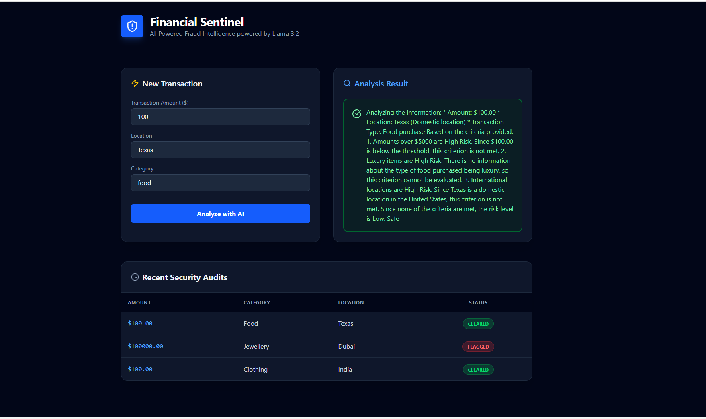

# 🛡️ Financial Sentinel

# 🛡️ Financial Sentinel: AI-Powered Fraud Detection
A Full-Stack Security Dashboard that uses Local LLMs to analyze transaction risk in real-time.

### 🚀 Tech Stack
- **Frontend:** Next.js 16, Tailwind CSS v4, Lucide Icons
- **Backend:** Java 21, Spring Boot 3.5, Spring Data JPA
- **AI Intelligence:** Llama 3.2 (via Ollama)
- **Database:** MySQL 8.0

### ✨ Key Features
- **Local AI Inference:** High-speed, private risk assessment without cloud costs.
- **Dynamic Risk Scoring:** Custom system prompts to flag high-value or unusual transactions.
- **Audit Trail:** Persistent history of all security scans stored in MySQL.

- ## 🔗 Live Demo
- **Frontend (UI/UX Only):** [financial-sentinel-ui.vercel.app](https://financial-sentinel-ui.vercel.app)
- **Full-Stack Note:** The live demo showcases the UI/UX design. To use the AI analysis features, the Spring Boot backend and local Ollama (Llama 3.2) instance must be running.
